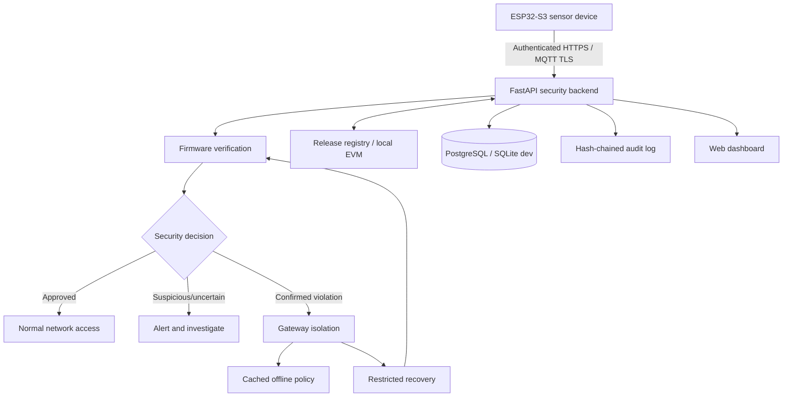

# Architecture

```mermaid
flowchart TD
  D[ESP32-S3 sensor device] -->|Authenticated HTTPS / MQTT TLS| B[FastAPI security backend]
  B --> V[Firmware verification]
  V --> S{Security decision}
  S -->|Approved| N[Normal network access]
  S -->|Suspicious/uncertain| A[Alert and investigate]
  S -->|Confirmed violation| G[Gateway isolation]
  B <--> R[Release registry / local EVM]
  B --> DB[(PostgreSQL / SQLite dev)]
  B --> L[Hash-chained audit log]
  B --> UI[Web dashboard]
  G --> C[Cached offline policy]
  G --> REC[Restricted recovery]
  REC --> V
```

The local demo runs a simulated gateway. Real enforcement needs a gateway-managed identity-to-network-address mapping and a reviewed firewall ruleset.
